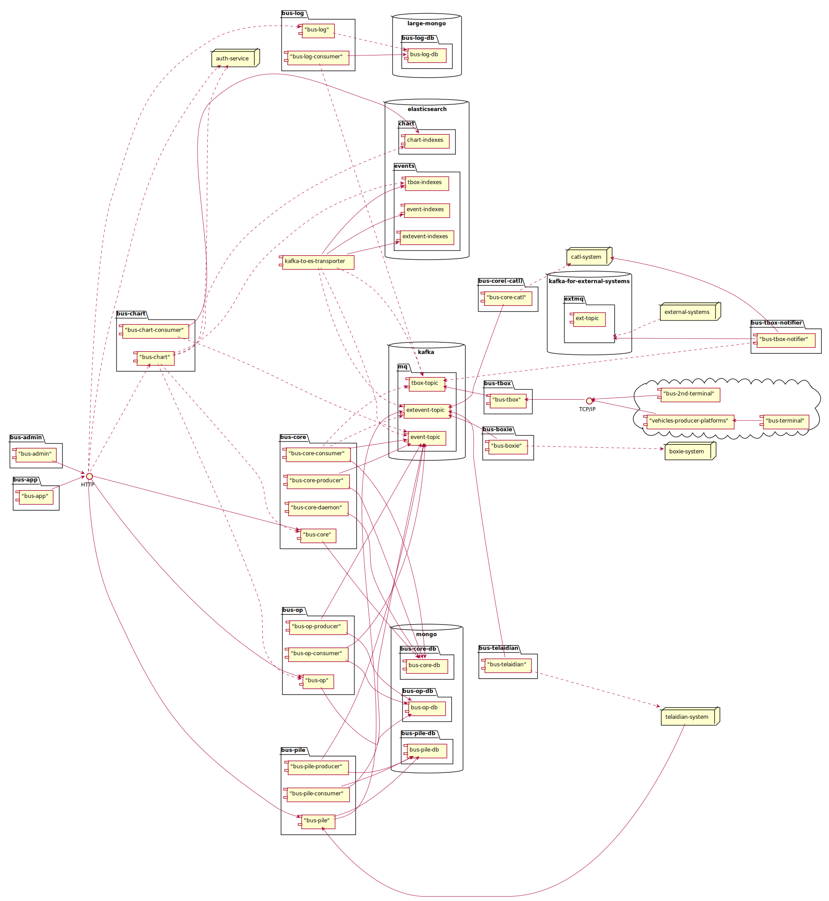

## 组件与连接件

* 组件与连接件视图

* 图例

### bus-admin

新能源车监控平台的中控台，提供用户界面。
通过HTTP/HTTPS提供外部访问。

部署时多实例负载均衡。

### bus-tbox

负责接收车载终端发回的监控数据，进行解析和应答。
数据格式遵循GB-32960标准。
目前通过TCP/IP方式接收数据。

部署时多实例负载均衡。

### bus-core

负责车辆档案等功能，和其他没有拆分出去的功能。

部署时bus-core多实例负载均衡。

部署时bus-core-consumer多实例分区消费kafka数据。

部署时bus-core-daemon为单实例。

部署时bus-core-producer为单实例。

### bus-op

负责报警处置、工单、异常等功能。

部署时bus-op多实例负载均衡。

部署时bus-op-consumer多实例分区消费kafka数据。

部署时bus-op-producer为单实例。

### bus-log

负责存储历史TBOX日志。

部署时bus-log多实例负载均衡。

部署时bus-log-consumer多实例分区消费kafka数据。

### bus-chart

负责历史状态查询、统计分析等功能。

部署时bus-chart多实例负载均衡。

部署时bus-chart-consumer多实例分区消费kafka数据。

### bus-boxie

负责获取外部路单信息。

部署时单实例，定期获取外部信息。

### bus-tbox-notifier

主要负责将系统的TBOX日志转发到其他外部系统、供外部系统消费的kafka、内部UAT系统。

部署时多实例分区消费kafka数据。
