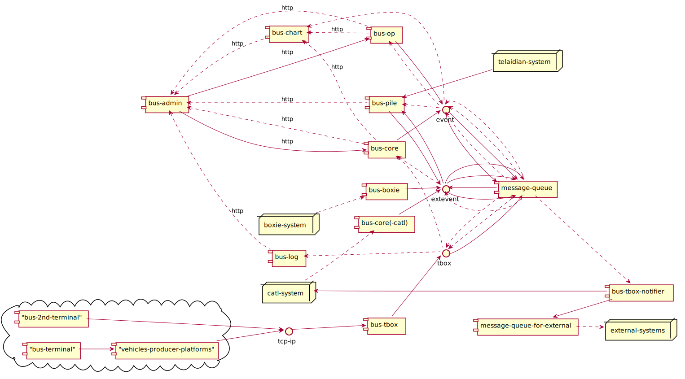

## 模块与集成模式

* 模块视图

* 图例

### 模块

#### bus-tbox

接收符合[GB-32960](https://github.com/36node/32960/blob/master/docs/32960.md)标准的数据，解析后输出TBOX事件。

#### bus-core

消费TBOX，产生ALERT、EXCEPTION等领域事件。

消费EXTEVENT，产生BANCI、WARNING等领域事件。

产生VEHICLE_SNAPSHOT、VEHICLE_DELETED等领域事件。

#### bus-op

消费ALERT、EXCEPTION等领域事件。

产生ALERT_CREATED、ALERT_UPDATED、EXCEPTION_CREATED等领域事件。

#### bus-chart

消费ALERT_CREATED、ALERT_UPDATED、EXCEPTION_CREATED、BANCI、WARNING等领域事件。

有时通过Web API直接调用bus-core和bus-op。

#### bus-log

消费TBOX，记录历史数据。

#### bus-admin

接收人员在Web界面上的操作，通过Web API调用各个服务。

#### bus-tbox-notifier

消费TBOX事件，转发到外部系统、或者内部的对外消息队列。

#### bus-boxie

获取外部系统路单信息，产生EXTEVENT。

#### bus-core(-catl)

获取外部系统电池预警信息，产生EXTEVENT。

### 集成模式

#### TCP/IP

车载终端和车企平台通过TCP/IP发送符合[GB-32960](https://github.com/36node/32960/blob/master/docs/32960.md)的车辆状态数据。

#### Message Queue

内部服务通过领域事件进行信息交换。
外部服务也通过消息队列获取信息。

#### HTTP

部分服务之间通过HTTP协议直接调用。

### 消息格式

TBOX数据格式参考[GB-32960](https://github.com/36node/32960/blob/master/docs/32960.md)。

EVENT/EXTEVENT数据格式参考[服务间对外接口](./interfaces/index.md)。
